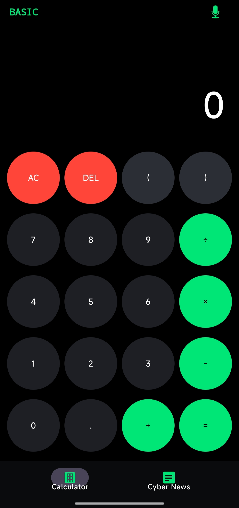
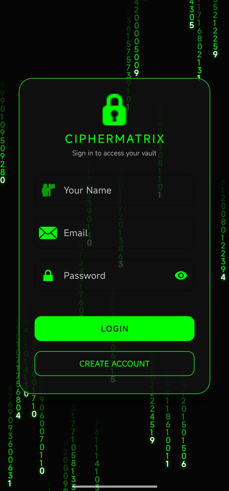
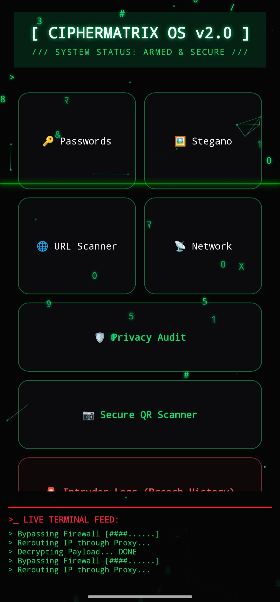
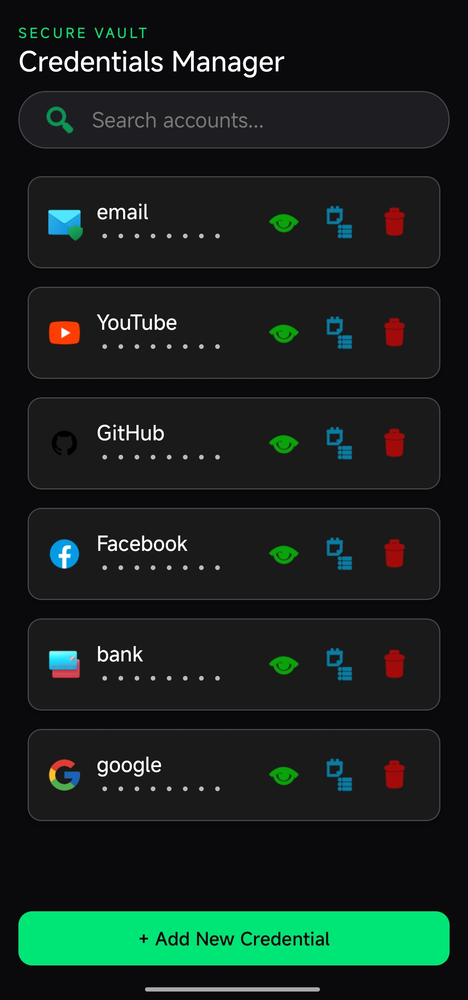
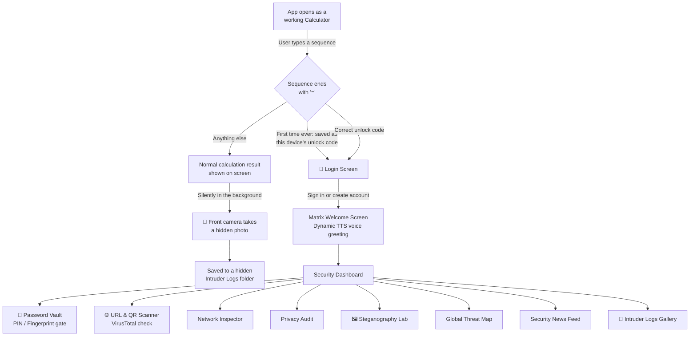
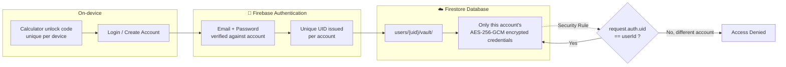

<div align="center">


#  CipherMatrix

### A calculator that isn't just a calculator.

A disguised Android security vault encrypted password manager, threat intelligence dashboard, and a full cybersecurity toolkit, hidden behind an ordinary calculator interface.


</div>

---

## 📑 Table of Contents

- [Overview](#-overview)
- [Screenshots](#-screenshots)
- [Why I Built This](#-why-i-built-this)
- [How It Works](#-how-it-works)
- [Architecture: Accounts & Data Isolation](#-architecture-accounts--data-isolation)
- [Features](#-features)
- [Tech Stack](#-tech-stack)
- [Installation](#-installation)
- [Usage Guide](#-usage-guide)
- [FAQ](#-faq)
- [Project Structure](#-project-structure)
- [Security Notes](#-security-notes)
- [Roadmap](#-roadmap)
- [License](#-license)

---

## 🔎 Overview

CipherMatrix is built around a simple idea: **security tools that hide in plain sight.** The app opens as a fully working calculator punch in numbers, do real math, even speak an equation out loud. But that calculator is a front door. Type the right sequence and the screen transitions into a personal login, then a Matrix-style command center giving access to a private encrypted vault, network tools, threat intelligence, and more.

Every account is fully isolated: each person who uses the app gets their own unlock code, their own login, and their own private vault  no shared data between users.

### At a Glance

| | |
|---|---|
| **Entry point** | A fully functional calculator, with voice input |
| **Accounts** | Firebase Authentication, one isolated vault per user |
| **Encryption** | AES-256-GCM, keys generated and sealed in the Android Keystore |
| **Security tools** | 8 built-in modules vault, URL scanner, network inspector, privacy audit, steganography lab, threat map, QR scanner, intruder logs |
| **Intrusion response** | Silent front-camera capture on every wrong unlock attempt |

## 📸 Screenshots

<div align="center">

| Calculator | Login | Dashboard | Password Vault |
|---|---|---|---|
|  |  |  |  |
| *Looks ordinary.* | *Isn't.* | *CipherMatrix OS* | *Encrypted & isolated* |

</div>

##  Why I Built This

I wanted to go beyond tutorials and actually *build* a real security product not a toy demo, but something with genuine threat modeling behind it: encryption that lives in hardware-backed storage, accounts that can't see each other's data even if the client is compromised, and a UI that doesn't advertise what it's protecting. CipherMatrix is that project a hands-on exploration of Android security engineering, from Keystore cryptography to Firebase access control, wrapped in an interface I'd actually want to use.

## ⚙️ How It Works



**In short:** every calculation you make is real. Every wrong unlock attempt is quietly logged with a photo. The right code leads to a login, and only a valid account reaches the vault.

## 🔐 Architecture: Accounts & Data Isolation

Each account created in the app is isolated from every other account, end to end from sign-in to the actual password data.



**What this guarantees:**
- Two people using the app never see each other's saved passwords each account's data lives in its own `users/{uid}/vault` path.
- The Firestore security rules enforce this server-side: even if someone tried to query another account's data directly, the rule `request.auth.uid == userId` blocks it.
- Access control is enforced at the database level, not just in the app's interface.
- Every credential is encrypted with a key that is generated and sealed inside the Android Keystore on first use it never exists as plain text in source code or leaves secure hardware.

##  Features

### 🔑 Accounts & Vault Access
| Feature | Description |
|---|---|
| **Calculator disguise** | A fully functional calculator (with voice input) is the app's real launcher icon and home screen |
| **Per-device unlock code** | The first calculation ever entered on a device silently becomes that device's unlock sequence |
| **Intruder Selfie** | Any *incorrect* unlock attempt silently snaps a front-camera photo and stores it in a hidden log |
| **Intruder Logs Gallery** | A gallery view (with timestamps) of everyone who tried to guess the code |
| **Account login system** | Email/password accounts via Firebase Authentication create an account or sign back in |
| **Dynamic voice greeting** | Text-to-Speech welcomes each account by name on login no fixed recording |
| **Per-user vault isolation** | Every account's saved credentials live in their own private Firestore path, enforced server-side |
| **PIN + Fingerprint vault lock** | A second layer on top of login: PIN code or biometric authentication gates the vault itself |
| **Auto re-lock** | The vault automatically re-locks itself the moment the app is minimized |
| **Keystore-backed AES-256-GCM** | Credentials are encrypted with a hardware-sealed key not a string in source code |

###  Threat & Network Tools
| Feature | Description |
|---|---|
| **URL Scanner** | Submits any link to the VirusTotal API and reports back whether it's flagged as malicious |
| **Secure QR Scanner** | Scans QR codes and automatically routes any URL through the URL Scanner before you ever open it |
| **Network Inspector** | Discovers devices on the local Wi-Fi network and reports connectivity details |
| **Privacy Audit** | Scans installed apps and permissions on the device, flagging potential privacy risks in a terminal-style readout |
| **Steganography Lab** | Hides and extracts secret text messages inside image files |
| **Global Threat Map** | An embedded live map visualizing cyberattacks happening around the world in real time |

### Awareness & Experience
| Feature | Description |
|---|---|
| **Security News Feed** | Pulls live cybersecurity headlines from a news API |
| **Matrix-style UI** | Custom animated "digital rain" and glitch-text views used throughout the app |
| **Immersive sound design** | Distinct sound cues for access granted, access denied, and intrusion alerts |
| **Voice input** | Speak an equation out loud on the calculator screen and it's transcribed and calculated |

##  Tech Stack

| Layer | Technology |
|---|---|
| Language | Kotlin |
| UI | AndroidX, Material 3 Components, custom `Canvas`-based views |
| Camera | Camera2 API (silent front-camera capture), CameraX (calculator) |
| Authentication | Firebase Authentication (Email/Password) |
| Biometrics | AndroidX Biometric (fingerprint vault gate) |
| Speech | Android TextToSpeech (dynamic voice greeting) |
| Networking | Retrofit2 + Gson, OkHttp logging interceptor |
| Cloud data | Firebase Firestore (per-user isolated collections) |
| Image loading | Glide |
| QR scanning | ZXing (`journeyapps` embedded) |
| Cryptography | AES-256-GCM via the Android Keystore |
| Async | Kotlin Coroutines |
| Math engine | exp4j (expression evaluation for the calculator) |
| External APIs | VirusTotal (URL reputation), News API (security headlines) |

## 🛠️ Installation

Want to build CipherMatrix yourself? Here's the full setup.

### 1. Clone the repository

```bash
git clone https://github.com/LahcenChehabi/CipherMatrix.git
```

Open the folder in **Android Studio** (`File > Open`) and let Gradle sync.

### 2. Set up Firebase

CipherMatrix needs its own Firebase project for Authentication and Firestore:

1. Go to the [Firebase Console](https://console.firebase.google.com/) and create a new project.
2. Add an Android app to it with the package name `com.example.ciphermatrix`, and download the generated `google-services.json`.
3. Place that file in the project's `app/` folder.
4. In **Authentication > Sign-in method**, enable the **Email/Password** provider.
5. In **Firestore Database**, create a database, then set the security rules to:

```js
rules_version = '2';
service cloud.firestore {
  match /databases/{database}/documents {
    match /users/{userId}/{document=**} {
      allow read, write: if request.auth != null && request.auth.uid == userId;
    }
  }
}
```

This keeps every account's vault private to that account only.

### 3. Add your API keys

Two features call external APIs and need free keys of your own:

- [VirusTotal](https://www.virustotal.com/gui/join-us) : powers the URL Scanner
- [NewsAPI](https://newsapi.org/) :powers the Security News Feed

Create a `local.properties` file in the project root (or add to the existing one) with:

```properties
VT_API_KEY=your_virustotal_api_key
NEWS_API_KEY=your_newsapi_key
```

This file is excluded from Git, so your keys stay private.

### 4. Build & run

Run the app on a device or emulator ideally one with a front camera and fingerprint sensor, to get the full experience.

## 📖 Usage Guide

1. **Open the app.** It launches as a plain, working calculator nothing looks unusual.
2. **Set your unlock code.** The very first calculation you type and confirm with `=` on a fresh install becomes your personal unlock code for that device. Choose it deliberately.
3. **Unlock the vault.** Type that same sequence again, followed by `=`, to move past the calculator into the login screen. Any other calculation just computes normally and a wrong attempt silently takes a front-camera photo in the background.
4. **Log in or create an account.** Accounts are isolated per person sign up with an email and password, or sign back into an existing one.
5. **Enter the dashboard.** A Matrix-style welcome animation plays with a personalized voice greeting, then lands you on the Security Dashboard the hub for every tool.
6. **Open the Password Vault.** The first time, set a PIN or enable fingerprint unlock. From there you can add, search, and generate encrypted credentials, all private to your account.
7. **Explore the other tools** from the dashboard : URL/QR scanner, network inspector, privacy audit, steganography lab, global threat map, and the security news feed.
8. **Check the Intruder Logs** any time to see timestamped photos of every wrong unlock attempt on your device.

## FAQ

**Why does my first calculation become the unlock code?**
It's the simplest way to give every installation its own private code without a setup wizard that tips off anyone watching. Just be deliberate about what you type the first time.

**Is my data safe if someone else uses my phone?**
Only if they don't know the unlock code or your account password and even then, the vault itself is gated behind a second PIN/fingerprint check. Every wrong unlock attempt is also silently photographed.

**Can two people use the same installed app with different vaults?**
Yes. Accounts are fully isolated through Firebase Authentication and per-user Firestore paths one person's saved credentials are never visible to another account, even on the same device.

**What happens if I forget my unlock code?**
There's currently no recovery flow for the calculator unlock code clearing the app's storage resets it, but that also clears the locally cached state. Your vault data itself stays safe in Firestore, tied to your account login.

## 📂 Project Structure

```
CipherMatrix/
└── app/src/main/
    ├── java/com/example/ciphermatrix/
    │   ├── MainActivity.kt              Calculator front-end + hidden camera trigger
    │   ├── LoginActivity.kt             Account login / registration (Firebase Auth)
    │   ├── WelcomeActivity.kt           Matrix intro animation + dynamic TTS greeting
    │   ├── SecurityDashboardActivity.kt Central hub / fake terminal animation
    │   ├── VaultAuthActivity.kt         PIN + fingerprint gate for the vault
    │   ├── PasswordsVaultActivity.kt    Encrypted, per-user credential manager
    │   ├── CryptoHelper.kt              Keystore-backed AES-256-GCM encrypt/decrypt
    │   ├── Credential.kt / CredentialAdapter.kt
    │   ├── UrlScannerActivity.kt / VirusTotalService.kt
    │   ├── SecureQrScannerActivity.kt
    │   ├── NetworkInspectorActivity.kt / NetworkDevice.kt
    │   ├── PrivacyAuditActivity.kt
    │   ├── StegoLabActivity.kt
    │   ├── GlobalThreatMapActivity.kt
    │   ├── IntruderAlertActivity.kt / IntruderLogsActivity.kt
    │   ├── NewsActivity.kt / NewsAdapter.kt / NewsArticle.kt
    │   ├── SoundManager.kt
    │   └── MatrixRainView.kt / RainViewDashboard.kt / ErrorMatrixView.kt
    └── res/raw/                         Sound effects (access granted/denied, intruder alert)
```

## 🔒 Security Notes

- **Per-user data isolation is enforced server-side** via Firestore security rules, not just in the app's UI this holds even if the client code were bypassed.
- **Encryption keys never touch source code.** The AES-256-GCM key used to protect the vault is generated on first use and sealed inside the Android Keystore, backed by hardware where available.
- API keys (VirusTotal, News API) live in `local.properties` / `BuildConfig` fields, never committed to source.
- The hidden-camera "intruder selfie" feature captures photos without the other person's knowledge this is intended purely as a personal anti-tamper feature for *your own device*.

## 🛣️ Roadmap

- [x] Per-user login / account system (Firebase Authentication)
- [x] Per-user vault isolation at the database level
- [x] Dynamic voice greeting (TTS) instead of a fixed recording
- [x] Keystore-backed AES-256-GCM encryption (no hardcoded key)
- [ ] More detection & security tools added over time

## 📄 License

Copyright (c) 2026 Lahcen Chehabi. All rights reserved.
See [LICENSE](LICENSE) for terms.

## Acknowledgments

CipherMatrix stands on the shoulders of some excellent open-source libraries:

- [Firebase](https://firebase.google.com/) : Authentication & Firestore
- [Retrofit](https://square.github.io/retrofit/) + [Gson](https://github.com/google/gson) : networking
- [Glide](https://github.com/bumptech/glide) : image loading
- [ZXing (journeyapps)](https://github.com/journeyapps/zxing-android-embedded) : QR scanning
- [exp4j](https://github.com/fasseg/exp4j) : expression evaluation for the calculator
- [AndroidX Biometric](https://developer.android.com/jetpack/androidx/releases/biometric) : fingerprint authentication

---

<div align="center">

**Built by [Lahcen Chehabi](https://github.com/LahcenChehabi)**

⭐ If this project caught your interest, consider giving it a star.

</div>
